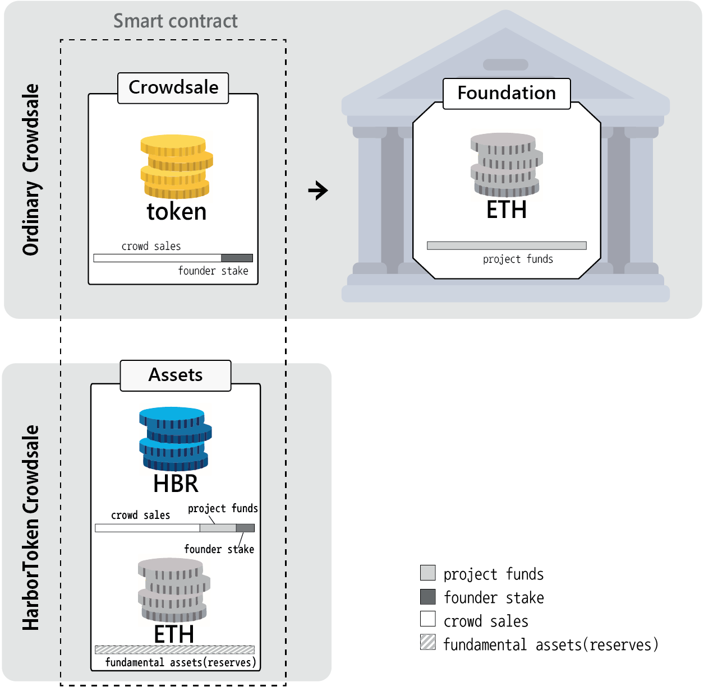
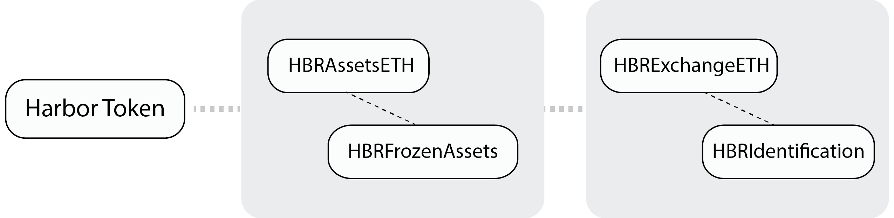

# Harbor UAICO

smart contract, Whitepaper, Harbor crowdsale information

## About Harbor token

Harbor Token is an ERC20-based cryptocurrency of the Ethereum network as a token with the right to purchase all goods and services distributed on the Harbor platform. It is a managed currency token that holds part of the assets at the time of issuance as a base asset and reserves, and the issuer controls the money supply.

  ## Characteristics of UAICO
- Interchangeable tokens by asset contract (Lowest price Guarantee and Growth Momentum)
- Configuration of diverse dsset portfolio
- Managed currency system
- Value creation through redistribution of currency issuance income
- Stable value growth by securing assets continuously
- New trials and experiments on cryptocurrency economics

## Major advantages of harbor UAICO
-	Maintain minimum value through the use of underlying assets
-	Reduces investment risks
-	Ability to increase the total supply through additional issuances without a plummet in price. allows small fundraising projects that focuses on long term growth, therefore reducing the damage from business failures and ICO scams. 
-	Provides cryptocurrencies that possess a common value among different cryptocurrencies and blockchain network. 
-	Democratic consensus protocol that empowers communities through its veto system

  

>Harbor crowdsale scenario examples (*This is just an example, not a plan.*)
>[link](https://docs.google.com/spreadsheets/d/1HoIUNR-K55de0KaysTnZiMjszJtl_qU0C0AXG58jlQc/edit?usp=sharing)

## Harbor crowdsale contract

### HBRAsetsETH
It manages assets of Harbor Token. The managed assets can be exchanged in the proportion to the volume of issued Harbor Tokens.

### HBRFrozenAssets
It is a contract to control the currency volume of HBR. It can increase supply temporarily but the increased supply will not be distributed. It will be burnt eventually.
Currency can be issued for the purpose of allotting or controlling the supply.
 
If the value of an asset stored in an asset contract rises sharply, it can temporarily increase the volume of money to reduce the impact of asset value volatility and prevent large-scale bank runs.
It reduces volatility and increases security by increasing the currency volume through issuing currency at the time of rise and burning it at the time of fall.

### HBRExchangeETH
It is the currency issuance contract that is associated with the asset contract. It manages Harbor Token issuance conditions. It consists of information such as the exchange rate and the period of time at the time of purchase, and the assets used in the purchase are transferred to the asset contract.

### HBRIdentification
It is for KYC and AML policies and manages user wallet account information.
To purchase more than a certain amount of HBR tokens, it must be authorized by the user. The authorization information will be stored in a separate server.
 

### ICO Contract deploy information

<!-- HarborCrowdsale: [0x84b42a80283a8936ffe95f1fe3762ba4538ce21a](https://etherscan.io/address/0x84b42a80283a8936ffe95f1fe3762ba4538ce21a) -->

> #### History of underlying asset currency and UAICO
> https://medium.com/@junghan.kim/new-ico-model-for-business-uaico-underlying-asset-initial-coin-offering-435c59c2c1d2

> #### A New ICO model for Businesses — UAICO (Underlying Asset ICO)
> https://medium.com/@junghan.kim/a-new-ico-model-for-businesses-uaico-underlying-asset-ico-25e9a4c478ee

> #### The Value of a Cryptocurrency and Additional Issuance
> https://medium.com/@junghan.kim/the-value-of-a-cryptocurrency-and-additional-issuance-bbc1d4350c1e

> #### Underlying Asset as a Momentum for Stability and Steady Increase in Price
> https://medium.com/@junghan.kim/underlying-asset-as-a-momentum-for-stability-and-steady-increase-in-price-b3f52b05ac40

> #### A new consensus protocol in creating a decentralized and democratic market–Underlying Asset ICO Veto System
> https://medium.com/@junghan.kim/a-new-consensus-protocol-in-creating-a-decentralized-and-democratic-market-underlying-asset-ico-cfc67a424db4

## About HarborPlatform

Technically, Harbor provides a library that allows software licenses to be securely managed using a block-chain network and to facilitate in-app billing using cryptocurrency.
Furthermore, we aim to build cross-platform support, easy software sales and a simple in-app payment system.
As a retailing channel for software sales, we provide a Harbor Store and support various applications using block-chain technology.

### brief description
https://medium.com/@junghan.kim/harbor-brief-description-e1ab7c0018a3

### Prototype
https://medium.com/@junghan.kim/harbor-platform-prototype-296ea429d513

### Video

### Site

#### https://www.toharbor.com

### UAICO online meetup: 
#### https://meetup.toharbor.com

## Harbor Platform Presentation

