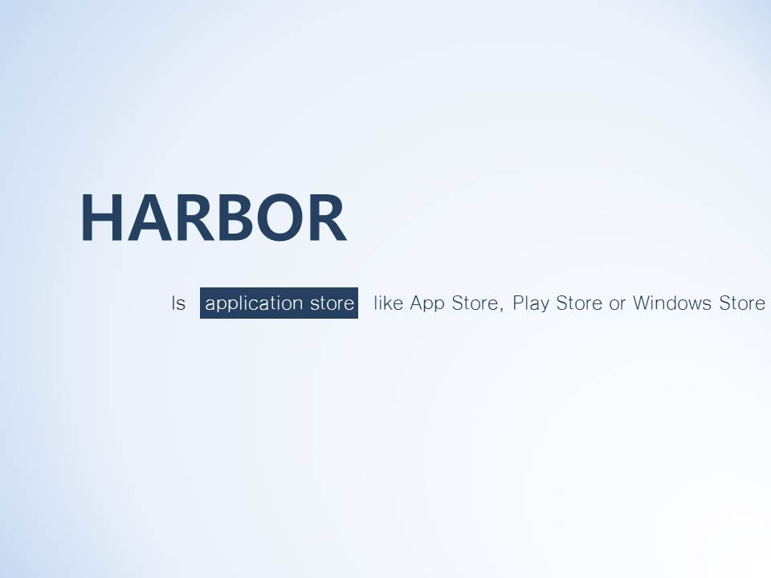
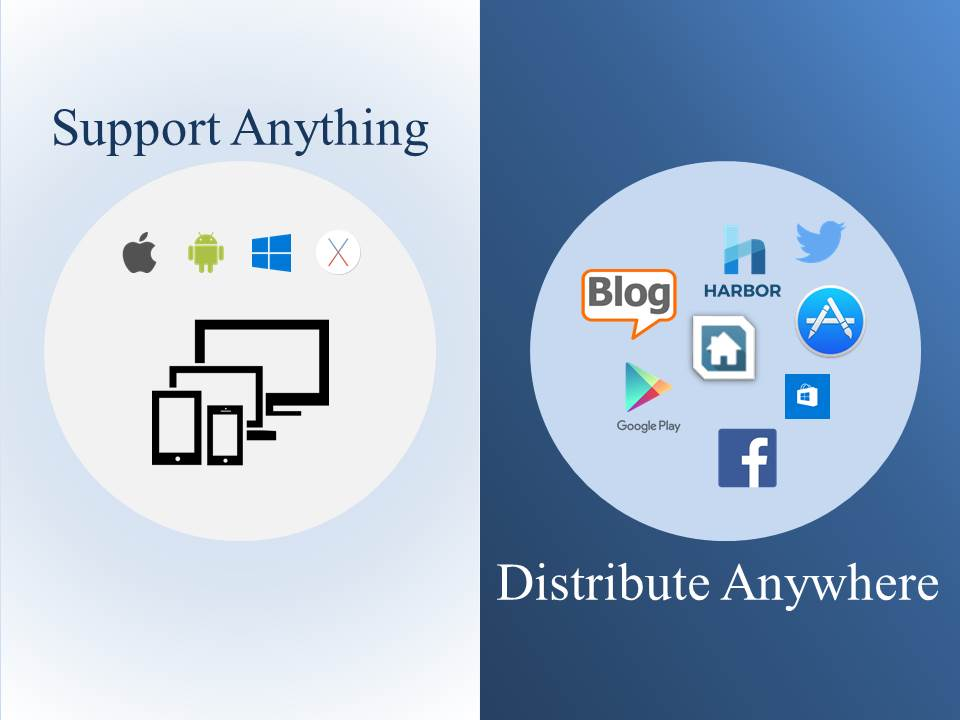
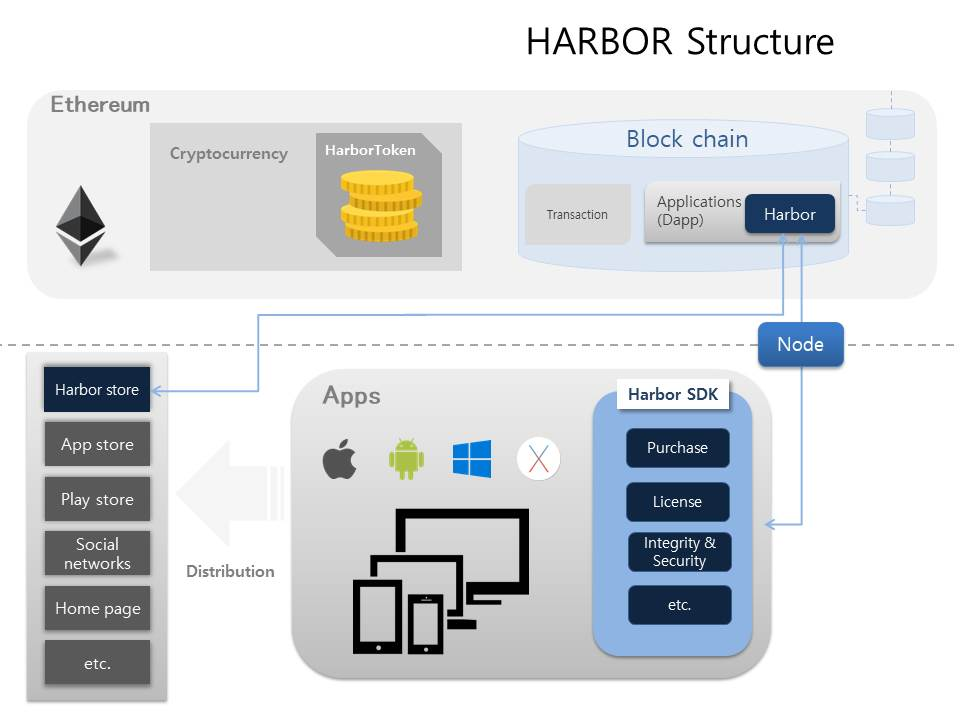
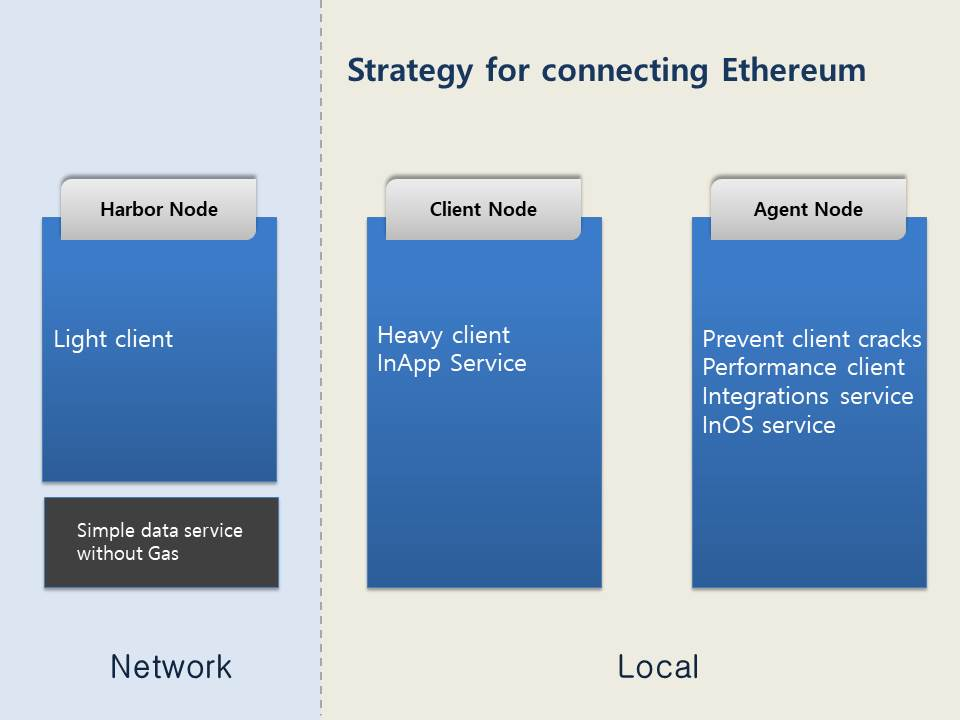
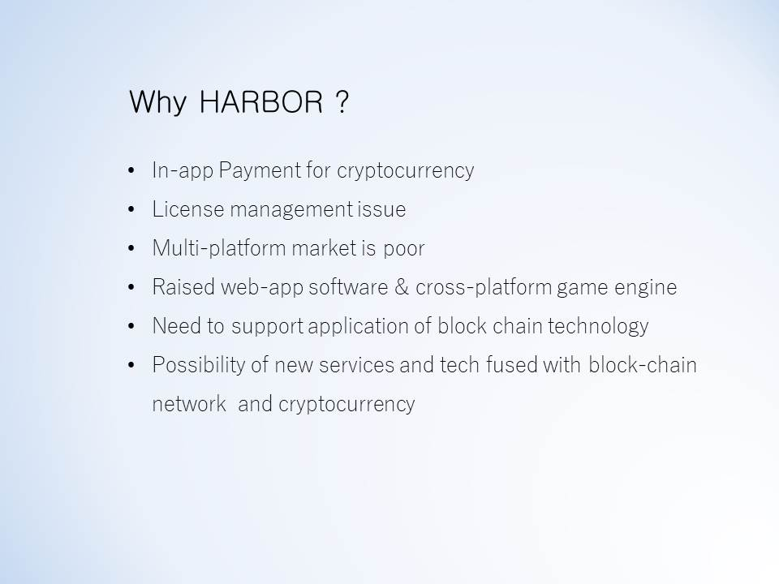
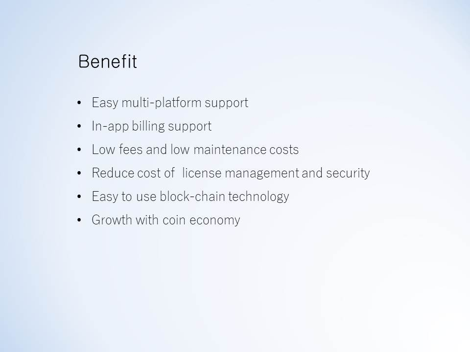
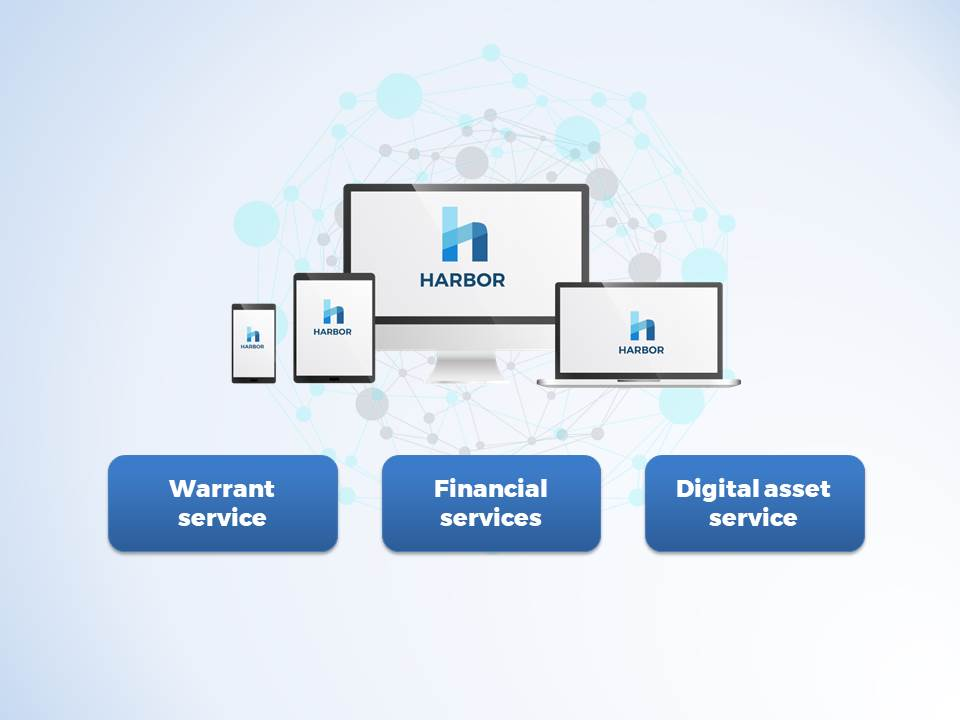
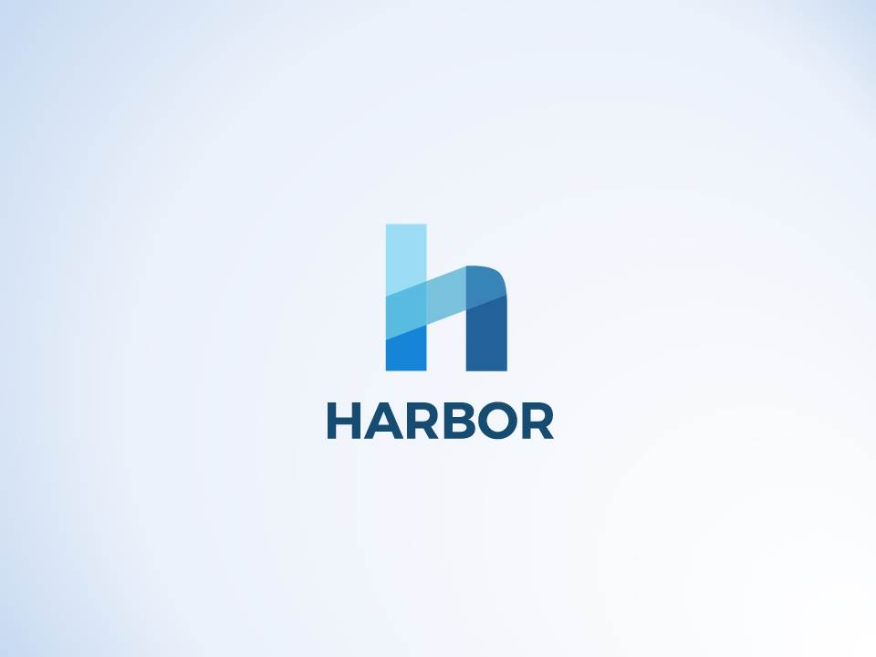

# Harbor ICO

smart contract, Whitepaper, Harbor ICO information

## About Harbor

Technically, Harbor provides a library that allows software licenses to be securely managed using a block-chain network and to facilitate in-app billing using cryptocurrency 
Furthermore, We aim to build cross-platform support, easy software sales and a simple in-app payment system.
As a retailing channel for software sales, we provide a Harbor store and support various applications using block chain technology.

### ICO Contract deploy information

HarborCrowdsale: [0x84b42a80283a8936ffe95f1fe3762ba4538ce21a](https://etherscan.io/address/0x84b42a80283a8936ffe95f1fe3762ba4538ce21a)

### Video

### Site

#### www.toharbor.com

## Presentation

