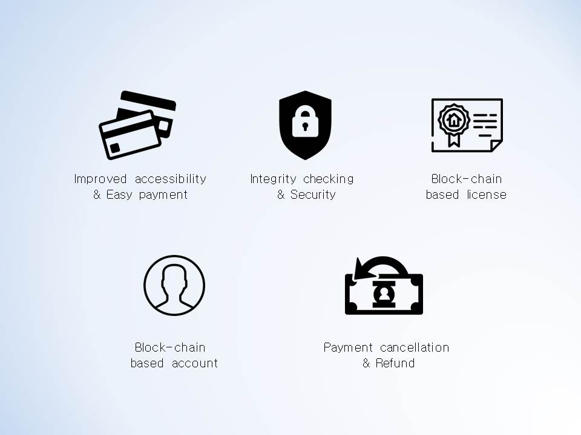

# Harbor crowdsale

smart contract, Whitepaper, Harbor crowdsale information

## About Harbor token

Harbor Token is a token with the right to purchase the software and the goods and services that are distributed in the harbor platform. It is a cryptocurrency based on ERC20 of Ethereum network, the management issued a token of how currency held some underlying asset and reserves, and the issuing body that controls the money supply of the goods to be exchanged during the token Harbor.

## Harbor crowdsale major Benefits

- Basic Asset Value
- Interchangeable tokens by asset contract (Price Guarantee and Growth Momentum)
- Configuration of diverse dsset portfolio
- Managed currency system
- Value creation through redistribution of currency issuance income
- Stable value growth by securing assets continuously
- New trials and experiments on cryptocurrency economics

Harbor crowdsale scenario examples (This is just an example, not a plan.)
https://docs.google.com/spreadsheets/d/1HoIUNR-K55de0KaysTnZiMjszJtl_qU0C0AXG58jlQc/edit?usp=sharing

## Harbor crowdsale contract

### HBRAsetsETH
It manages assets of Harbor Token. The managed assets can be exchanged in the proportion to the volume of issued Harbor Tokens.

### HBRFrozenAssets
It is a contract to control the currency volume of HBR. It can increase supply temporarily but the increased supply will not be distributed. It will be burnt eventually.
Currency can be issued for the purpose of allotting or controlling the supply.
 
If the value of an asset stored in an asset contract rises sharply, it can temporarily increase the volume of money to reduce the impact of asset value volatility and prevent large-scale bank runs.
It reduces volatility and increases security by increasing the currency volume through issuing currency at the time of rise and burning it at the time of fall.

### HBRExchangeETH
It is the currency issuance contract that is associated with the asset contract. It manages Harbor Token issuance conditions. It consists of information such as the exchange rate and the period of time at the time of purchase, and the assets used in the purchase are transferred to the asset contract.

### HBRIdentification
It is for KYC and AML policies and manages user wallet account information.
To purchase more than a certain amount of HBR tokens, it must be authorized by the user. The authorization information will be stored in a separate server.
 

### ICO Contract deploy information

<!-- HarborCrowdsale: [0x84b42a80283a8936ffe95f1fe3762ba4538ce21a](https://etherscan.io/address/0x84b42a80283a8936ffe95f1fe3762ba4538ce21a) -->

### Video

### Site

#### www.toharbor.com

## About HarborPlatform

Technically, Harbor provides a library that allows software licenses to be securely managed using a block-chain network and to facilitate in-app billing using cryptocurrency.
Furthermore, we aim to build cross-platform support, easy software sales and a simple in-app payment system.
As a retailing channel for software sales, we provide a Harbor Store and support various applications using block-chain technology.

## Harbor Platform Presentation

